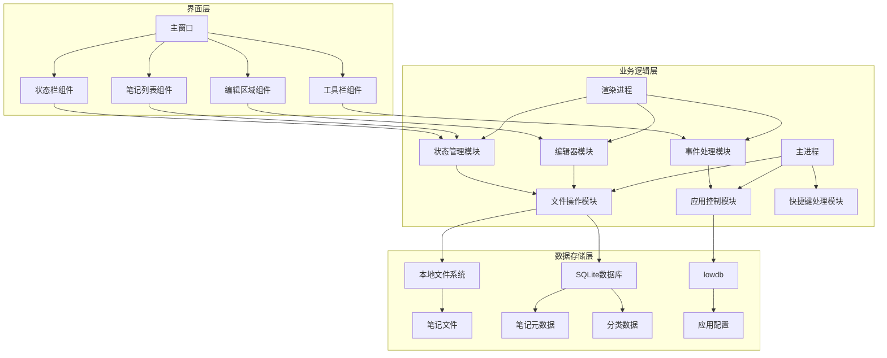

# 记事本项目技术方案文档

## 1. 技术方案概述

### 1.1 项目背景
本项目是一个个人使用的记事本应用，旨在提供简洁、高效的文本编辑和管理功能。根据需求分析，项目初期主要实现核心功能，包括文本编辑、文件管理和数据持久化，为个人用户提供一个轻量级的本地记事本工具。

### 1.2 技术方案目标
- **轻量级**：适合个人日常使用，资源占用少
- **跨平台**：支持主流操作系统，提供一致的用户体验
- **高效稳定**：响应迅速，运行稳定，数据安全可靠
- **易于扩展**：预留高级功能的扩展空间

## 2. 技术选型

### 2.1 前端技术

| 技术 | 版本 | 选型理由 |
|------|------|----------|
| Electron | 20.0.0+ | 跨平台桌面应用开发框架，基于Chromium和Node.js，支持Windows、macOS、Linux |
| Vue.js | 3.2.0+ | 轻量级前端框架，响应式数据绑定，组件化开发，适合构建用户界面 |
| Vite | 3.0.0+ | 快速的前端构建工具，提供热更新和优化的构建过程 |
| SCSS | 1.50.0+ | CSS预处理器，提供变量、嵌套、混合等功能，便于样式管理 |
| Element Plus | 2.2.0+ | 基于Vue 3的UI组件库，提供丰富的界面组件，加速开发 |

### 2.2 后端技术

| 技术 | 版本 | 选型理由 |
|------|------|----------|
| Node.js | 16.0.0+ | 基于Chrome V8引擎的JavaScript运行时，与Electron集成紧密 |
| Express | 4.18.0+ | 轻量级Node.js Web框架，用于构建本地API服务（可选） |
| TypeScript | 4.7.0+ | JavaScript的超集，提供类型系统，提高代码可维护性 |

### 2.3 存储技术

| 技术 | 版本 | 选型理由 |
|------|------|----------|
| 本地文件系统 | - | 直接存储笔记文件，简单可靠，易于备份和迁移 |
| SQLite | 3.38.0+ | 轻量级嵌入式数据库，用于存储笔记元数据和索引，提高检索效率 |
| lowdb | 5.0.0+ | 基于JSON文件的轻量级数据库，用于存储应用配置和用户偏好设置 |

### 2.4 开发工具

| 工具 | 版本 | 用途 |
|------|------|------|
| Visual Studio Code | 1.68.0+ | 代码编辑器，支持TypeScript、Vue等语言的语法高亮和智能提示 |
| Git | 2.36.0+ | 版本控制工具，管理代码版本 |
| ESLint | 8.0.0+ | 代码质量检查工具，确保代码风格一致 |
| Prettier | 2.8.0+ | 代码格式化工具，保持代码格式一致 |
| Jest | 28.0.0+ | JavaScript测试框架，用于单元测试 |

## 3. 系统架构

### 3.1 架构概述
本项目采用Electron的主进程-渲染进程架构，结合Vue.js的组件化开发模式，构建一个轻量级的桌面记事本应用。系统分为界面层、业务逻辑层和数据存储层三个主要层次，实现关注点分离和模块化设计。

### 3.2 架构图



### 3.3 模块划分

| 模块 | 职责 | 实现技术 | 所在层 |
|------|------|----------|--------|
| 主窗口 | 应用主界面容器 | Electron BrowserWindow | 界面层 |
| 笔记列表 | 显示和管理笔记列表 | Vue组件 | 界面层 |
| 编辑区域 | 文本编辑功能 | Vue组件 + 编辑器库 | 界面层 |
| 工具栏 | 提供常用操作按钮 | Vue组件 | 界面层 |
| 状态栏 | 显示应用状态信息 | Vue组件 | 界面层 |
| 文件操作 | 笔记文件的读写操作 | Node.js fs模块 | 业务逻辑层 |
| 应用控制 | 应用生命周期管理 | Electron主进程 | 业务逻辑层 |
| 快捷键处理 | 键盘快捷键支持 | Electron全局快捷键 | 业务逻辑层 |
| 编辑器 | 文本编辑核心功能 | Vue组件 + 原生textarea | 业务逻辑层 |
| 状态管理 | 应用状态管理 | Vue 3 Composition API | 业务逻辑层 |
| 事件处理 | 用户交互事件处理 | Vue事件系统 | 业务逻辑层 |
| 本地文件系统 | 存储笔记文件 | Node.js fs模块 | 数据存储层 |
| SQLite数据库 | 存储笔记元数据和索引 | sqlite3模块 | 数据存储层 |
| lowdb | 存储应用配置 | lowdb模块 | 数据存储层 |

## 4. 核心功能实现方案

### 4.1 文本编辑功能

#### 4.1.1 创建新笔记
- **实现方式**：通过工具栏按钮或快捷键触发创建新笔记操作
- **技术实现**：
  1. 生成唯一笔记ID和默认标题（基于当前时间）
  2. 创建空白笔记对象，包含ID、标题、内容、创建时间等属性
  3. 在界面上打开新的编辑标签页
  4. 自动聚焦到编辑区域，准备输入内容

#### 4.1.2 编辑笔记内容
- **实现方式**：在编辑区域直接输入和修改文本
- **技术实现**：
  1. 使用HTML5 textarea元素作为编辑区域，支持基本文本输入
  2. 实现文本选择、复制、粘贴、剪切等基本操作
  3. 支持撤销/重做功能，使用栈结构存储操作历史
  4. 实时更新笔记内容到内存中的笔记对象

#### 4.1.3 格式化文本
- **实现方式**：通过工具栏按钮或快捷键应用文本格式
- **技术实现**：
  1. 实现基本的文本格式化，如粗体、斜体、下划线等
  2. 使用CSS样式实现格式化效果的预览
  3. 存储格式化信息，支持保存和加载

### 4.2 文件管理功能

#### 4.2.1 保存笔记
- **实现方式**：自动保存和手动保存两种方式
- **技术实现**：
  1. 自动保存：设置定时保存机制，默认每30秒自动保存一次
  2. 手动保存：通过工具栏按钮或快捷键触发保存操作
  3. 将笔记内容写入本地文件系统
  4. 更新SQLite数据库中的笔记元数据

#### 4.2.2 打开笔记
- **实现方式**：从笔记列表中选择笔记打开
- **技术实现**：
  1. 显示笔记列表，包含标题、修改时间等信息
  2. 点击列表项打开对应笔记
  3. 从本地文件系统读取笔记内容
  4. 在编辑区域显示笔记内容

#### 4.2.3 删除笔记
- **实现方式**：通过右键菜单或快捷键删除笔记
- **技术实现**：
  1. 显示确认对话框，防止误操作
  2. 从本地文件系统删除对应的笔记文件
  3. 从SQLite数据库中删除对应的笔记元数据
  4. 从界面的笔记列表中移除该笔记

#### 4.2.4 重命名笔记
- **实现方式**：通过右键菜单或双击标题重命名笔记
- **技术实现**：
  1. 显示重命名对话框，允许修改笔记标题
  2. 更新内存中的笔记对象标题
  3. 更新本地文件系统中的文件名
  4. 更新SQLite数据库中的笔记元数据

#### 4.2.5 笔记列表
- **实现方式**：在左侧面板显示笔记列表
- **技术实现**：
  1. 从SQLite数据库加载笔记元数据
  2. 支持按标题、创建时间、修改时间排序
  3. 支持搜索和筛选功能
  4. 显示笔记的基本信息，如标题、修改时间、是否置顶等

### 4.3 数据持久化功能

#### 4.3.1 本地存储
- **实现方式**：使用本地文件系统存储笔记内容，SQLite存储元数据
- **技术实现**：
  1. 笔记内容存储为纯文本文件，使用UTF-8编码
  2. 笔记元数据存储在SQLite数据库中，包含ID、标题、路径、创建时间、修改时间等
  3. 使用Node.js的fs模块进行文件操作
  4. 使用sqlite3模块进行数据库操作

#### 4.3.2 自动保存
- **实现方式**：定时自动保存和内容变化时触发保存
- **技术实现**：
  1. 使用setInterval设置定时保存任务
  2. 监听编辑区域的input事件，检测内容变化
  3. 实现防抖机制，避免频繁保存影响性能
  4. 保存时更新文件内容和数据库中的修改时间

## 5. 数据存储方案

### 5.1 数据模型

#### 5.1.1 笔记数据模型
| 字段名 | 数据类型 | 描述 | 约束 |
|--------|----------|------|------|
| id | TEXT | 笔记唯一标识符（UUID） | PRIMARY KEY |
| title | TEXT | 笔记标题 | NOT NULL |
| content_path | TEXT | 笔记内容文件路径 | NOT NULL |
| create_time | INTEGER | 创建时间（时间戳） | NOT NULL |
| update_time | INTEGER | 更新时间（时间戳） | NOT NULL |
| category_id | TEXT | 分类ID | REFERENCES categories(id) |
| is_pinned | INTEGER | 是否置顶（0/1） | DEFAULT 0 |
| is_encrypted | INTEGER | 是否加密（0/1） | DEFAULT 0 |

#### 5.1.2 分类数据模型
| 字段名 | 数据类型 | 描述 | 约束 |
|--------|----------|------|------|
| id | TEXT | 分类唯一标识符（UUID） | PRIMARY KEY |
| name | TEXT | 分类名称 | NOT NULL |
| create_time | INTEGER | 创建时间（时间戳） | NOT NULL |
| color | TEXT | 分类颜色（十六进制） | DEFAULT '#3366FF' |

#### 5.1.3 应用配置模型
| 配置项 | 数据类型 | 描述 | 默认值 |
|--------|----------|------|--------|
| auto_save_interval | INTEGER | 自动保存间隔（秒） | 30 |
| default_font | TEXT | 默认字体 | 'Arial' |
| default_font_size | INTEGER | 默认字体大小 | 14 |
| theme | TEXT | 界面主题 | 'light' |
| window_size | OBJECT | 窗口大小和位置 | {width: 800, height: 600, x: 0, y: 0} |

### 5.2 存储实现

#### 5.2.1 文件存储结构
```
notepad/
├── data/
│   ├── notes/              # 笔记文件存储目录
│   │   ├── {id}.txt        # 笔记内容文件
│   │   └── ...
│   ├── database/           # 数据库存储目录
│   │   └── notes.db        # SQLite数据库文件
│   └── config/             # 配置文件存储目录
│       └── config.json     # 应用配置文件
├── src/                    # 源代码目录
├── package.json            # 项目配置文件
└── ...
```

#### 5.2.2 数据库初始化
- **实现方式**：应用首次启动时初始化数据库
- **技术实现**：
  1. 检查数据库文件是否存在，不存在则创建
  2. 创建notes和categories表
  3. 插入默认分类数据
  4. 建立必要的索引，优化查询性能

#### 5.2.3 数据备份与恢复
- **实现方式**：手动备份和自动备份
- **技术实现**：
  1. 手动备份：提供导出功能，将所有笔记导出为压缩包
  2. 自动备份：定期创建数据库和文件的备份
  3. 恢复功能：从备份文件恢复数据
  4. 备份文件存储在用户指定的目录

## 6. 界面设计

### 6.1 界面布局
- **顶部**：菜单栏和工具栏，包含文件、编辑、视图等菜单
- **左侧**：笔记列表面板，显示所有笔记的标题和基本信息
- **右侧**：编辑区域，用于输入和修改笔记内容
- **底部**：状态栏，显示当前笔记的字数、修改时间等信息

### 6.2 界面风格
- **设计理念**：简洁、现代、专注于内容
- **色彩方案**：
  - 浅色主题：白色背景，深色文本，蓝色强调色
  - 深色主题：深色背景，浅色文本，蓝色强调色
- **字体**：默认使用系统字体，保证良好的可读性
- **图标**：使用简约风格的图标，保持界面清爽

### 6.3 响应式设计
- **实现方式**：适配不同屏幕尺寸
- **技术实现**：
  1. 支持窗口大小调整，布局自动适应
  2. 笔记列表宽度可调节
  3. 在小屏幕设备上优化布局，确保核心功能可用

## 7. 性能优化

### 7.1 启动速度优化
- **实现方式**：减少启动时的加载时间
- **技术实现**：
  1. 延迟加载非核心模块，优先启动主窗口
  2. 优化资源加载顺序，先加载必要的资源
  3. 缓存常用数据，避免重复读取

### 7.2 响应速度优化
- **实现方式**：提高用户操作的响应速度
- **技术实现**：
  1. 使用防抖和节流技术，优化频繁操作的处理
  2. 实现异步操作，避免阻塞主线程
  3. 优化DOM操作，减少重排和重绘

### 7.3 存储性能优化
- **实现方式**：提高数据存储和检索的效率
- **技术实现**：
  1. 使用SQLite索引，优化查询性能
  2. 实现增量保存，只保存修改的部分
  3. 定期优化数据库，清理冗余数据

## 8. 安全考虑

### 8.1 数据安全
- **实现方式**：保护用户数据的安全性
- **技术实现**：
  1. 本地存储为主，减少网络传输风险
  2. 支持笔记加密功能，保护敏感信息
  3. 实现数据备份机制，防止数据丢失

### 8.2 应用安全
- **实现方式**：防止应用被恶意攻击
- **技术实现**：
  1. 使用Electron的安全特性，如contextIsolation和sandbox
  2. 验证用户输入，防止注入攻击
  3. 定期更新依赖库，修复安全漏洞

## 9. 开发流程

### 9.1 开发阶段

| 阶段 | 任务 | 时间估计 |
|------|------|----------|
| 初始化 | 项目搭建，环境配置，依赖安装 | 1天 |
| 核心功能开发 | 文本编辑、文件管理、数据持久化 | 5天 |
| 界面优化 | UI设计，交互体验改进 | 2天 |
| 测试与调试 | 功能测试，性能测试，bug修复 | 2天 |
| 打包发布 | 应用打包，生成安装文件 | 1天 |

### 9.2 里程碑
- **M1**：项目初始化完成，环境搭建成功
- **M2**：核心功能开发完成，基本功能可用
- **M3**：界面优化完成，用户体验良好
- **M4**：测试与调试完成，应用稳定可靠
- **M5**：打包发布完成，生成可安装的应用程序

### 9.3 开发规范
- **代码风格**：遵循ESLint和Prettier的代码规范
- **命名规范**：使用语义化的变量和函数命名
- **注释规范**：关键代码添加注释，解释设计思路和实现细节
- **版本控制**：使用Git进行版本控制，遵循Git Flow工作流

## 10. 测试计划

### 10.1 测试目标
- **功能测试**：验证所有核心功能是否正常工作
- **性能测试**：测试应用的响应速度和资源占用
- **兼容性测试**：测试应用在不同操作系统上的表现
- **安全测试**：测试应用的安全性和数据保护能力

### 10.2 测试用例

#### 10.2.1 功能测试
| 测试项 | 测试步骤 | 预期结果 |
|--------|----------|----------|
| 创建新笔记 | 点击"新建"按钮，输入内容 | 笔记创建成功，内容保存 |
| 编辑笔记 | 打开现有笔记，修改内容 | 内容修改成功，保存后生效 |
| 保存笔记 | 编辑内容后，等待自动保存或手动保存 | 笔记内容成功保存到文件 |
| 打开笔记 | 从列表中选择笔记打开 | 笔记内容正确显示在编辑区域 |
| 删除笔记 | 选择笔记，执行删除操作 | 笔记从列表中移除，文件被删除 |
| 重命名笔记 | 选择笔记，执行重命名操作 | 笔记标题更新，文件名同步更新 |

#### 10.2.2 性能测试
| 测试项 | 测试步骤 | 预期结果 |
|--------|----------|----------|
| 启动速度 | 测量应用从启动到主窗口显示的时间 | 启动时间≤3秒 |
| 响应速度 | 测量编辑操作的响应时间 | 响应时间≤0.5秒 |
| 搜索速度 | 测量搜索操作的响应时间 | 搜索时间≤1秒（1000条笔记以内） |
| 内存占用 | 测量应用运行时的内存使用情况 | 内存占用≤200MB |

#### 10.2.3 兼容性测试
| 测试项 | 测试步骤 | 预期结果 |
|--------|----------|----------|
| Windows兼容性 | 在Windows 10/11上运行应用 | 应用正常运行，功能完整 |
| macOS兼容性 | 在macOS 12+上运行应用 | 应用正常运行，功能完整 |
| Linux兼容性 | 在Ubuntu 20.04+上运行应用 | 应用正常运行，功能完整 |

#### 10.2.4 安全测试
| 测试项 | 测试步骤 | 预期结果 |
|--------|----------|----------|
| 数据加密 | 测试加密笔记功能 | 加密笔记需要密码才能查看 |
| 数据备份 | 测试备份和恢复功能 | 备份文件可用于恢复数据 |
| 输入验证 | 测试特殊字符输入 | 应用能正确处理特殊输入，无崩溃 |

## 11. 部署与发布

### 11.1 应用打包
- **实现方式**：使用Electron Builder打包应用
- **技术实现**：
  1. 配置打包参数，生成不同平台的安装文件
  2. 包含必要的依赖和资源文件
  3. 生成应用图标和快捷方式

### 11.2 发布渠道
- **实现方式**：本地发布和版本管理
- **技术实现**：
  1. 生成安装包文件，保存在本地
  2. 记录版本变更日志，便于跟踪更新
  3. 实现自动更新检查功能，提示用户更新

## 12. 扩展与未来规划

### 12.1 功能扩展
- **中期规划**：
  - 实现笔记分类和标签功能
  - 添加搜索和筛选功能
  - 支持导出为多种格式（PDF、Markdown等）
  - 实现云同步功能，支持多设备访问

- **长期规划**：
  - 添加富文本编辑功能
  - 支持插入图片和其他媒体内容
  - 实现笔记版本历史和恢复
  - 添加插件系统，支持功能扩展

### 12.2 技术升级
- **技术栈升级**：跟踪Electron、Vue.js等技术的最新版本，及时升级
- **性能优化**：持续优化应用性能，提高用户体验
- **安全加强**：关注安全漏洞，及时修复和更新

## 13. 结论

本技术方案基于Electron和Vue.js构建一个轻量级的个人记事本应用，实现核心功能包括文本编辑、文件管理和数据持久化。方案采用模块化设计，层次清晰，易于维护和扩展。通过本地文件系统和SQLite数据库实现数据存储，确保数据安全可靠。

技术方案充分考虑了性能优化和安全因素，确保应用运行高效、稳定、安全。同时，方案预留了扩展空间，支持未来添加高级功能，满足用户不断增长的需求。

该技术方案适合项目初期的核心功能开发，为个人用户提供一个简洁、高效的本地记事本工具。