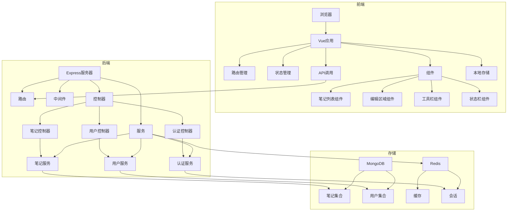

# 记事本项目技术方案文档（Web版）

## 1. 技术方案概述

### 1.1 项目背景
本项目是一个个人使用的Web版记事本应用，旨在提供简洁、高效的文本编辑和管理功能。根据需求分析，项目初期主要实现核心功能，包括文本编辑、文件管理和数据持久化，为个人用户提供一个轻量级的Web端记事本工具。

### 1.2 技术方案目标
- **轻量级**：适合个人日常使用，资源占用少
- **跨平台**：支持主流浏览器，提供一致的用户体验
- **高效稳定**：响应迅速，运行稳定，数据安全可靠
- **易于扩展**：预留高级功能的扩展空间
- **离线可用**：支持离线编辑和数据同步

## 2. 技术选型

### 2.1 前端技术

| 技术 | 版本 | 选型理由 |
|------|------|----------|
| Vue.js | 3.2.0+ | 轻量级前端框架，响应式数据绑定，组件化开发，适合构建用户界面 |
| Vite | 3.0.0+ | 快速的前端构建工具，提供热更新和优化的构建过程 |
| TypeScript | 4.7.0+ | JavaScript的超集，提供类型系统，提高代码可维护性 |
| SCSS | 1.50.0+ | CSS预处理器，提供变量、嵌套、混合等功能，便于样式管理 |
| Element Plus | 2.2.0+ | 基于Vue 3的UI组件库，提供丰富的界面组件，加速开发 |
| Vue Router | 4.0.0+ | Vue官方路由管理器，用于单页应用的路由控制 |
| Pinia | 2.0.0+ | Vue 3的状态管理库，替代Vuex，提供更简洁的API |
| Axios | 0.27.0+ | 基于Promise的HTTP客户端，用于前后端数据交互 |
| Monaco Editor | 0.33.0+ | 微软开发的代码编辑器，提供优秀的文本编辑体验 |
| Workbox | 6.5.0+ | Google开发的PWA工具库，用于实现离线缓存和PWA功能 |

### 2.2 后端技术

| 技术 | 版本 | 选型理由 |
|------|------|----------|
| Node.js | 16.0.0+ | 基于Chrome V8引擎的JavaScript运行时，适合构建高性能的Web服务 |
| Express | 4.18.0+ | 轻量级Node.js Web框架，用于构建RESTful API |
| TypeScript | 4.7.0+ | JavaScript的超集，提供类型系统，提高代码可维护性 |
| Mongoose | 6.4.0+ | MongoDB对象建模工具，提供Schema验证和中间件支持 |
| Redis | 4.1.0+ | 用于缓存和会话管理，提高系统性能 |
| Passport | 0.6.0+ | 认证中间件，支持多种认证策略 |
| JWT | 8.5.0+ | JSON Web Token，用于无状态的用户认证 |
| CORS | 2.8.5+ | 跨域资源共享中间件，解决前后端分离的跨域问题 |
| Morgan | 1.10.0+ | HTTP请求日志中间件，便于调试和监控 |
| Helmet | 5.1.0+ | 安全中间件，设置HTTP头增强安全性 |

### 2.3 存储技术

| 技术 | 版本 | 选型理由 |
|------|------|----------|
| MongoDB | 5.0.0+ | 文档型数据库，适合存储结构化的笔记数据，支持复杂查询 |
| Redis | 7.0.0+ | 内存数据库，用于缓存热点数据和管理用户会话 |
| 浏览器本地存储 | - | 使用localStorage/sessionStorage/IndexedDB存储离线数据 |
| Cloudinary | - | 云存储服务，用于存储图片等多媒体内容（可选） |

### 2.4 开发工具

| 工具 | 版本 | 用途 |
|------|------|------|
| Visual Studio Code | 1.68.0+ | 代码编辑器，支持TypeScript、Vue等语言的语法高亮和智能提示 |
| Git | 2.36.0+ | 版本控制工具，管理代码版本 |
| ESLint | 8.0.0+ | 代码质量检查工具，确保代码风格一致 |
| Prettier | 2.8.0+ | 代码格式化工具，保持代码格式一致 |
| Jest | 28.0.0+ | JavaScript测试框架，用于单元测试 |
| Cypress | 10.0.0+ | 端到端测试框架，用于集成测试 |
| Postman | 9.0.0+ | API测试工具，用于测试后端接口 |

## 3. 系统架构

### 3.1 架构概述
本项目采用前后端分离架构，前端使用Vue 3构建单页应用，后端使用Express提供RESTful API，数据存储在MongoDB中。同时，利用浏览器本地存储实现离线功能，提供更好的用户体验。

### 3.2 架构图



### 3.3 模块划分

#### 3.3.1 前端模块

| 模块 | 职责 | 实现技术 |
|------|------|----------|
| 主应用 | 应用入口，全局配置 | Vue 3, Vite |
| 路由管理 | 页面路由控制 | Vue Router |
| 状态管理 | 全局状态管理 | Pinia |
| 笔记列表 | 显示和管理笔记列表 | Vue 3组件 |
| 编辑区域 | 文本编辑功能 | Vue 3组件, Monaco Editor |
| 工具栏 | 提供常用操作按钮 | Vue 3组件, Element Plus |
| 状态栏 | 显示应用状态信息 | Vue 3组件 |
| API调用 | 与后端API交互 | Axios |
| 本地存储 | 离线数据存储 | localStorage, IndexedDB |

#### 3.3.2 后端模块

| 模块 | 职责 | 实现技术 |
|------|------|----------|
| 服务器 | 应用入口，中间件配置 | Express |
| 路由 | API路由定义 | Express Router |
| 中间件 | 请求处理，认证授权 | Express中间件 |
| 控制器 | 请求处理逻辑 | TypeScript |
| 服务 | 业务逻辑处理 | TypeScript |
| 模型 | 数据模型定义 | Mongoose |
| 工具 | 通用工具函数 | TypeScript |

## 4. 核心功能实现方案

### 4.1 文本编辑功能

#### 4.1.1 创建新笔记
- **实现方式**：通过工具栏按钮或快捷键触发创建新笔记操作
- **技术实现**：
  1. 前端：生成唯一笔记ID和默认标题（基于当前时间），创建空白笔记对象
  2. 前端：在界面上打开新的编辑页面，自动聚焦到编辑区域
  3. 后端：接收创建笔记请求，验证用户身份，保存笔记数据到MongoDB
  4. 前端：保存成功后更新本地状态和本地存储

#### 4.1.2 编辑笔记内容
- **实现方式**：在编辑区域直接输入和修改文本
- **技术实现**：
  1. 前端：使用Monaco Editor作为编辑组件，支持基本文本编辑操作
  2. 前端：实现文本选择、复制、粘贴、剪切等基本操作
  3. 前端：支持撤销/重做功能，使用栈结构存储操作历史
  4. 前端：实时更新笔记内容到内存中的笔记对象
  5. 前端：使用防抖技术，延迟发送更新请求到后端
  6. 后端：接收更新请求，验证用户身份，更新MongoDB中的笔记数据

#### 4.1.3 格式化文本
- **实现方式**：通过工具栏按钮或快捷键应用文本格式
- **技术实现**：
  1. 前端：实现基本的文本格式化，如粗体、斜体、下划线等
  2. 前端：使用CSS样式实现格式化效果的预览
  3. 前端：存储格式化信息，支持保存和加载
  4. 后端：存储包含格式化信息的笔记内容

### 4.2 文件管理功能

#### 4.2.1 保存笔记
- **实现方式**：自动保存和手动保存两种方式
- **技术实现**：
  1. 前端：自动保存：设置定时保存机制，默认每30秒自动保存一次
  2. 前端：手动保存：通过工具栏按钮或快捷键触发保存操作
  3. 前端：将笔记内容发送到后端API
  4. 后端：接收保存请求，验证用户身份，更新MongoDB中的笔记数据
  5. 前端：保存成功后更新本地状态和本地存储

#### 4.2.2 打开笔记
- **实现方式**：从笔记列表中选择笔记打开
- **技术实现**：
  1. 前端：显示笔记列表，包含标题、修改时间等信息
  2. 前端：点击列表项打开对应笔记
  3. 前端：首先检查本地存储是否有离线数据
  4. 前端：如果本地没有或需要最新数据，发送请求到后端API
  5. 后端：接收请求，验证用户身份，从MongoDB获取笔记数据
  6. 前端：在编辑区域显示笔记内容

#### 4.2.3 删除笔记
- **实现方式**：通过右键菜单或快捷键删除笔记
- **技术实现**：
  1. 前端：显示确认对话框，防止误操作
  2. 前端：发送删除请求到后端API
  3. 后端：接收删除请求，验证用户身份，从MongoDB删除笔记数据
  4. 前端：删除成功后更新本地状态和本地存储
  5. 前端：从界面的笔记列表中移除该笔记

#### 4.2.4 重命名笔记
- **实现方式**：通过右键菜单或双击标题重命名笔记
- **技术实现**：
  1. 前端：显示重命名对话框，允许修改笔记标题
  2. 前端：发送更新请求到后端API
  3. 后端：接收更新请求，验证用户身份，更新MongoDB中的笔记标题
  4. 前端：更新成功后更新本地状态和本地存储
  5. 前端：更新界面上的笔记标题

#### 4.2.5 笔记列表
- **实现方式**：在左侧面板显示笔记列表
- **技术实现**：
  1. 前端：发送请求到后端API获取笔记列表
  2. 后端：接收请求，验证用户身份，从MongoDB获取笔记元数据
  3. 前端：显示笔记列表，包含标题、修改时间等信息
  4. 前端：支持按标题、创建时间、修改时间排序
  5. 前端：支持搜索和筛选功能

### 4.3 数据持久化功能

#### 4.3.1 本地存储
- **实现方式**：使用浏览器本地存储存储离线数据
- **技术实现**：
  1. 前端：使用localStorage存储简单数据，如用户偏好设置
  2. 前端：使用IndexedDB存储复杂数据，如笔记内容
  3. 前端：实现数据同步机制，确保本地数据与服务器数据一致
  4. 前端：支持离线编辑，网络恢复后自动同步

#### 4.3.2 服务器存储
- **实现方式**：使用MongoDB存储笔记数据
- **技术实现**：
  1. 后端：定义笔记数据模型，包含ID、标题、内容、创建时间、修改时间等字段
  2. 后端：实现CRUD操作，支持创建、读取、更新、删除笔记
  3. 后端：使用Mongoose进行数据验证和中间件处理
  4. 后端：实现数据备份和恢复机制

#### 4.3.3 缓存机制
- **实现方式**：使用Redis缓存热点数据
- **技术实现**：
  1. 后端：使用Redis缓存用户会话和热点笔记数据
  2. 后端：设置缓存过期时间，确保数据一致性
  3. 后端：实现缓存更新机制，确保缓存数据与数据库数据一致

## 5. 数据存储方案

### 5.1 数据模型

#### 5.1.1 笔记数据模型

```typescript
// 后端数据模型 (Mongoose Schema)
interface Note {
  _id: string;
  userId: string;
  title: string;
  content: string;
  createdAt: Date;
  updatedAt: Date;
  isPinned: boolean;
  category: string;
  tags: string[];
  isEncrypted: boolean;
}

// 前端数据模型
interface Note {
  id: string;
  title: string;
  content: string;
  createdAt: Date;
  updatedAt: Date;
  isPinned: boolean;
  category: string;
  tags: string[];
  isEncrypted: boolean;
}
```

#### 5.1.2 用户数据模型

```typescript
// 后端数据模型 (Mongoose Schema)
interface User {
  _id: string;
  username: string;
  email: string;
  password: string;
  createdAt: Date;
  updatedAt: Date;
  preferences: UserPreferences;
}

interface UserPreferences {
  theme: string;
  autoSaveInterval: number;
  defaultFont: string;
  defaultFontSize: number;
}
```

### 5.2 存储实现

#### 5.2.1 MongoDB存储
- **集合**：notes, users
- **索引**：为常用查询字段创建索引，如userId, createdAt, updatedAt
- **分片**：根据用户ID进行分片，提高查询性能

#### 5.2.2 Redis存储
- **缓存**：热点笔记数据，用户会话
- **过期时间**：缓存数据设置合理的过期时间
- **持久化**：开启RDB或AOF持久化，防止数据丢失

#### 5.2.3 浏览器本地存储
- **localStorage**：存储用户偏好设置，简单配置
- **IndexedDB**：存储离线笔记数据，支持复杂查询
- **存储策略**：定期清理过期数据，限制存储大小

### 5.3 数据同步

#### 5.3.1 离线同步
- **实现方式**：使用Service Worker和IndexedDB
- **技术实现**：
  1. 前端：使用Service Worker拦截网络请求
  2. 前端：当网络不可用时，将数据存储到IndexedDB
  3. 前端：当网络恢复时，自动将本地数据同步到服务器
  4. 前端：处理数据冲突，确保数据一致性

#### 5.3.2 实时同步
- **实现方式**：使用WebSocket或Server-Sent Events
- **技术实现**：
  1. 后端：使用WebSocket服务器推送数据更新
  2. 前端：建立WebSocket连接，接收实时更新
  3. 前端：当接收到更新时，自动同步本地数据

## 6. 界面设计

### 6.1 界面布局
- **顶部**：菜单栏和工具栏，包含文件、编辑、视图等菜单
- **左侧**：笔记列表面板，显示所有笔记的标题和基本信息
- **右侧**：编辑区域，用于输入和修改笔记内容
- **底部**：状态栏，显示当前笔记的字数、修改时间等信息

### 6.2 界面风格
- **设计理念**：简洁、现代、专注于内容
- **色彩方案**：
  - 浅色主题：白色背景，深色文本，蓝色强调色
  - 深色主题：深色背景，浅色文本，蓝色强调色
- **字体**：默认使用系统字体，保证良好的可读性
- **图标**：使用简约风格的图标，保持界面清爽

### 6.3 响应式设计
- **实现方式**：适配不同屏幕尺寸
- **技术实现**：
  1. 使用CSS Flexbox和Grid布局，实现响应式设计
  2. 支持窗口大小调整，布局自动适应
  3. 笔记列表宽度可调节
  4. 在移动设备上优化布局，确保核心功能可用
  5. 使用媒体查询，针对不同屏幕尺寸优化样式

### 6.4 交互设计
- **操作反馈**：提供即时的操作反馈，如保存成功提示
- **快捷键**：支持常用操作的快捷键，提高操作效率
- **拖拽功能**：支持笔记拖拽排序和分类
- **自动完成**：提供文本输入的自动完成功能
- **错误处理**：提供友好的错误提示和恢复机制

## 7. 性能优化

### 7.1 前端优化

#### 7.1.1 加载性能
- **实现方式**：减少页面加载时间
- **技术实现**：
  1. 使用Vite进行代码分割和按需加载
  2. 优化资源加载顺序，先加载必要的资源
  3. 使用浏览器缓存，减少重复请求
  4. 压缩静态资源，减少传输大小
  5. 使用CDN加速静态资源加载

#### 7.1.2 运行性能
- **实现方式**：提高应用运行速度
- **技术实现**：
  1. 使用Vue 3的Composition API，减少组件开销
  2. 优化DOM操作，减少重排和重绘
  3. 使用虚拟滚动，处理大量笔记列表
  4. 使用防抖和节流技术，优化频繁操作的处理
  5. 实现异步组件，按需加载大型组件

#### 7.1.3 内存管理
- **实现方式**：减少内存使用，避免内存泄漏
- **技术实现**：
  1. 及时清理事件监听器和定时器
  2. 避免循环引用，合理使用WeakMap和WeakSet
  3. 优化大型数据结构的存储和处理
  4. 使用Web Workers处理耗时操作，避免阻塞主线程

### 7.2 后端优化

#### 7.2.1 API性能
- **实现方式**：提高API响应速度
- **技术实现**：
  1. 使用Express的路由缓存，减少路由解析开销
  2. 实现请求缓存，减少重复计算
  3. 使用Redis缓存热点数据，减少数据库查询
  4. 优化数据库查询，使用索引和聚合管道
  5. 实现批量操作，减少API调用次数

#### 7.2.2 数据库性能
- **实现方式**：提高数据库查询和写入速度
- **技术实现**：
  1. 为常用查询字段创建索引
  2. 使用MongoDB的聚合管道，优化复杂查询
  3. 实现数据库连接池，减少连接开销
  4. 定期清理过期数据，优化数据库大小
  5. 使用MongoDB的Write Concern，平衡一致性和性能

#### 7.2.3 服务器性能
- **实现方式**：提高服务器处理能力
- **技术实现**：
  1. 使用Node.js的集群模式，充分利用多核CPU
  2. 优化中间件使用，减少不必要的中间件
  3. 实现请求限流，防止服务器过载
  4. 使用负载均衡，分散请求压力
  5. 定期监控服务器性能，及时调整配置

## 8. 安全考虑

### 8.1 前端安全

#### 8.1.1 输入验证
- **实现方式**：验证用户输入，防止注入攻击
- **技术实现**：
  1. 使用Vue的v-model和自定义验证，验证用户输入
  2. 使用TypeScript的类型系统，确保数据类型正确
  3. 对特殊字符进行转义，防止XSS攻击
  4. 实现内容安全策略(CSP)，防止恶意脚本执行

#### 8.1.2 认证授权
- **实现方式**：确保用户身份验证和授权
- **技术实现**：
  1. 使用JWT进行无状态的用户认证
  2. 实现token过期和刷新机制
  3. 存储token在HttpOnly cookie中，防止XSS攻击
  4. 实现CSRF保护，防止跨站请求伪造

#### 8.1.3 数据保护
- **实现方式**：保护用户数据的安全性
- **技术实现**：
  1. 使用HTTPS加密传输数据
  2. 实现前端数据加密，保护敏感信息
  3. 限制本地存储的敏感数据，避免信息泄露
  4. 实现数据清除机制，在用户登出时清除本地数据

### 8.2 后端安全

#### 8.2.1 API安全
- **实现方式**：保护API接口的安全性
- **技术实现**：
  1. 使用Express的helmet中间件，设置安全的HTTP头
  2. 实现API请求频率限制，防止暴力攻击
  3. 验证所有API请求的参数，防止注入攻击
  4. 实现API版本控制，便于安全更新

#### 8.2.2 认证授权
- **实现方式**：确保用户身份验证和授权
- **技术实现**：
  1. 使用bcrypt加密存储用户密码
  2. 实现多因素认证，增强安全性
  3. 使用Passport中间件，支持多种认证策略
  4. 实现基于角色的访问控制(RBAC)，限制用户权限

#### 8.2.3 数据库安全
- **实现方式**：保护数据库的安全性
- **技术实现**：
  1. 使用环境变量存储数据库连接字符串，避免硬编码
  2. 实现数据库用户权限管理，限制数据库操作权限
  3. 定期备份数据库，防止数据丢失
  4. 实现数据库加密，保护敏感数据

### 8.3 部署安全

#### 8.3.1 服务器安全
- **实现方式**：保护服务器的安全性
- **技术实现**：
  1. 使用防火墙，限制服务器访问
  2. 定期更新服务器软件，修复安全漏洞
  3. 实现服务器监控，及时发现异常
  4. 使用容器化部署，隔离应用环境

#### 8.3.2 CI/CD安全
- **实现方式**：确保持续集成和部署的安全性
- **技术实现**：
  1. 使用安全的CI/CD流程，避免敏感信息泄露
  2. 实现自动化安全测试，及时发现安全问题
  3. 使用签名验证，确保部署的代码完整性
  4. 实现部署回滚机制，应对安全事件

## 9. 离线功能

### 9.1 离线编辑
- **实现方式**：支持在无网络连接时编辑笔记
- **技术实现**：
  1. 使用Service Worker缓存应用资源
  2. 使用IndexedDB存储离线笔记数据
  3. 实现离线编辑状态管理，标记离线修改的笔记
  4. 提供离线模式提示，告知用户当前状态

### 9.2 数据同步
- **实现方式**：在网络连接恢复时同步离线数据
- **技术实现**：
  1. 监听网络状态变化，检测连接恢复
  2. 实现冲突检测和解决机制，处理数据冲突
  3. 按优先级同步离线数据，确保重要数据优先同步
  4. 提供同步状态提示，告知用户同步进度

### 9.3 离线存储
- **实现方式**：优化离线数据存储
- **技术实现**：
  1. 使用IndexedDB存储大量离线数据
  2. 实现数据压缩，减少存储空间
  3. 设置存储配额管理，避免超出浏览器限制
  4. 实现数据清理机制，删除过期离线数据

## 10. 开发流程

### 10.1 开发阶段

| 阶段 | 任务 | 时间估计 |
|------|------|----------|
| 初始化 | 项目搭建，环境配置，依赖安装 | 1天 |
| 前端开发 | 核心组件开发，界面实现 | 5天 |
| 后端开发 | API实现，业务逻辑开发 | 4天 |
| 集成测试 | 前后端集成，功能测试 | 2天 |
| 性能优化 | 性能测试，优化改进 | 2天 |
| 安全测试 | 安全测试，漏洞修复 | 1天 |
| 部署上线 | 应用部署，监控配置 | 1天 |

### 10.2 里程碑
- **M1**：项目初始化完成，环境搭建成功
- **M2**：前端核心组件开发完成
- **M3**：后端API开发完成
- **M4**：前后端集成测试完成
- **M5**：性能优化和安全测试完成
- **M6**：应用部署上线

### 10.3 开发规范

#### 10.3.1 代码风格
- **前端**：遵循Vue 3官方风格指南，使用ESLint和Prettier
- **后端**：遵循Node.js和TypeScript官方风格指南，使用ESLint和Prettier

#### 10.3.2 命名规范
- **文件命名**：使用kebab-case或PascalCase，根据文件类型
- **变量命名**：使用camelCase，常量使用UPPER_SNAKE_CASE
- **函数命名**：使用camelCase，类名使用PascalCase
- **组件命名**：使用PascalCase，与文件名保持一致

#### 10.3.3 注释规范
- **文件头部**：包含文件描述、作者、创建时间等信息
- **函数注释**：使用JSDoc格式，描述函数参数、返回值和功能
- **复杂逻辑**：添加注释，解释设计思路和实现细节
- **API文档**：使用Swagger或OpenAPI，生成API文档

#### 10.3.4 版本控制
- **分支管理**：使用Git Flow工作流，主分支、开发分支、特性分支
- **提交规范**：使用Conventional Commits，规范提交信息
- **标签管理**：使用语义化版本号，标记重要版本

## 11. 测试计划

### 11.1 测试目标
- **功能测试**：验证所有核心功能是否正常工作
- **性能测试**：测试应用的响应速度和资源占用
- **兼容性测试**：测试应用在不同浏览器和设备上的表现
- **安全测试**：测试应用的安全性和数据保护能力
- **离线测试**：测试应用的离线功能和数据同步

### 11.2 测试策略

#### 11.2.1 前端测试
- **单元测试**：使用Jest测试组件和工具函数
- **组件测试**：使用Vue Test Utils测试组件交互
- **端到端测试**：使用Cypress测试完整用户流程
- **视觉测试**：使用Percy测试UI一致性

#### 11.2.2 后端测试
- **单元测试**：使用Jest测试服务和工具函数
- **API测试**：使用Supertest测试API接口
- **集成测试**：测试数据库和服务的集成
- **性能测试**：使用Artillery测试API性能

### 11.3 测试用例

#### 11.3.1 功能测试

| 测试项 | 测试步骤 | 预期结果 |
|--------|----------|----------|
| 创建新笔记 | 点击"新建"按钮，输入内容，保存 | 笔记创建成功，内容保存 |
| 编辑笔记 | 打开现有笔记，修改内容，保存 | 内容修改成功，保存后生效 |
| 保存笔记 | 编辑内容后，等待自动保存或手动保存 | 笔记内容成功保存到服务器 |
| 打开笔记 | 从列表中选择笔记打开 | 笔记内容正确显示在编辑区域 |
| 删除笔记 | 选择笔记，执行删除操作 | 笔记从列表中移除，服务器数据删除 |
| 重命名笔记 | 选择笔记，执行重命名操作 | 笔记标题更新，服务器数据更新 |
| 离线编辑 | 断开网络连接，编辑笔记，恢复网络 | 离线编辑成功，网络恢复后自动同步 |
| 数据同步 | 在不同设备上编辑同一笔记 | 数据同步成功，无冲突或冲突解决机制生效 |

#### 11.3.2 性能测试

| 测试项 | 测试步骤 | 预期结果 |
|--------|----------|----------|
| 页面加载速度 | 测量页面从请求到完全加载的时间 | 加载时间≤2秒 |
| API响应速度 | 测量API请求的响应时间 | 响应时间≤500ms |
| 编辑响应速度 | 测量编辑操作的响应时间 | 响应时间≤100ms |
| 内存使用 | 测量应用运行时的内存使用情况 | 内存占用≤200MB |
| 并发处理 | 模拟多个用户同时访问应用 | 应用稳定运行，响应时间无明显增加 |

#### 11.3.3 兼容性测试

| 测试项 | 测试步骤 | 预期结果 |
|--------|----------|----------|
| 浏览器兼容性 | 在Chrome、Firefox、Safari、Edge等浏览器上测试 | 应用正常运行，功能完整 |
| 设备兼容性 | 在桌面、平板、手机等设备上测试 | 应用正常运行，布局适配 |
| 分辨率兼容性 | 在不同屏幕分辨率下测试 | 应用正常运行，布局适配 |
| 网络兼容性 | 在不同网络条件下测试 | 应用正常运行，离线功能生效 |

#### 11.3.4 安全测试

| 测试项 | 测试步骤 | 预期结果 |
|--------|----------|----------|
| XSS攻击 | 输入包含脚本的内容，测试是否执行 | 脚本不执行，内容正常显示 |
| CSRF攻击 | 模拟跨站请求，测试是否执行 | 请求被拒绝，保护生效 |
| SQL注入 | 输入包含SQL语句的内容，测试是否执行 | SQL语句不执行，内容正常处理 |
| 认证绕过 | 尝试绕过认证访问受保护资源 | 访问被拒绝，认证生效 |
| 数据泄露 | 检查网络传输和本地存储的数据 | 敏感数据加密，无泄露 |

## 12. 部署与监控

### 12.1 部署方案

#### 12.1.1 前端部署
- **构建**：使用Vite构建生产版本
- **托管**：使用Netlify、Vercel或AWS S3 + CloudFront
- **CDN**：使用CDN加速静态资源加载
- **CI/CD**：使用GitHub Actions或GitLab CI自动部署

#### 12.1.2 后端部署
- **容器化**：使用Docker容器化部署
- **托管**：使用Heroku、AWS EC2或DigitalOcean Droplet
- **数据库**：使用MongoDB Atlas或AWS DocumentDB
- **缓存**：使用Redis Cloud或AWS ElastiCache
- **CI/CD**：使用GitHub Actions或GitLab CI自动部署

### 12.2 监控方案

#### 12.2.1 前端监控
- **性能监控**：使用Google Analytics或New Relic
- **错误监控**：使用Sentry或LogRocket
- **用户行为**：使用Google Analytics或Mixpanel
- **可用性监控**：使用Uptime Robot或Pingdom

#### 12.2.2 后端监控
- **服务器监控**：使用Prometheus + Grafana
- **API监控**：使用Datadog或New Relic
- **数据库监控**：使用MongoDB Atlas监控或AWS CloudWatch
- **错误监控**：使用Sentry或ELK Stack

### 12.3 日志管理
- **前端日志**：使用console.log和Sentry捕获前端错误
- **后端日志**：使用Winston或Bunyan记录后端日志
- **日志聚合**：使用ELK Stack或Graylog聚合和分析日志
- **日志保留**：设置合理的日志保留策略，确保合规性

## 13. 扩展与未来规划

### 13.1 功能扩展

#### 13.1.1 中期规划
- **笔记分类**：实现笔记分类和标签功能
- **高级搜索**：添加全文搜索和高级筛选功能
- **多格式导出**：支持导出为PDF、Markdown等格式
- **模板系统**：提供笔记模板，快速创建常用类型的笔记
- **协作功能**：支持多用户协作编辑笔记

#### 13.1.2 长期规划
- **富文本编辑**：添加富文本编辑功能，支持复杂格式
- **多媒体支持**：支持插入图片、视频、音频等多媒体内容
- **版本历史**：实现笔记版本历史和恢复功能
- **插件系统**：添加插件系统，支持功能扩展
- **AI辅助**：集成AI功能，如智能摘要、语法检查等

### 13.2 技术升级
- **技术栈升级**：跟踪Vue.js、Express等技术的最新版本，及时升级
- **性能优化**：持续优化应用性能，提高用户体验
- **安全加强**：关注安全漏洞，及时修复和更新
- **架构演进**：根据业务需求，演进系统架构

### 13.3 生态系统
- **移动应用**：开发配套的移动应用，实现多端同步
- **浏览器扩展**：开发浏览器扩展，提供快速访问功能
- **API开放**：开放API，支持与其他应用集成
- **社区建设**：建立用户社区，收集反馈和建议

## 14. 结论

本技术方案基于Vue.js和Express构建一个轻量级的Web版记事本应用，实现核心功能包括文本编辑、文件管理和数据持久化。方案采用前后端分离架构，模块化设计，层次清晰，易于维护和扩展。通过MongoDB存储数据，Redis缓存热点数据，浏览器本地存储实现离线功能，确保数据的安全性和可靠性。

技术方案充分考虑了性能优化和安全因素，确保应用运行高效、稳定、安全。同时，方案预留了扩展空间，支持未来添加高级功能，满足用户不断增长的需求。

该技术方案适合项目初期的核心功能开发，为个人用户提供一个简洁、高效的Web端记事本工具。